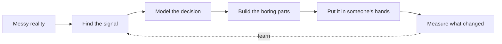

<div align="center">

```text
╭────────────────────────────────────────────────────────────────────────╮
│                                                                        │
│   A B H I S H E K   R   B I R A D A R                                │
│                                                                        │
│   OPERATOR PROFILE  /  HUMAN IN THE LOOP  /  BUILD 01                 │
│                                                                        │
│   I build systems for the part of reality that refuses to be neat.    │
│                                                                        │
╰────────────────────────────────────────────────────────────────────────╯
```

`[ SIGNAL: OPEN ]` &nbsp; `[ DOMAIN: APPLIED AI ]` &nbsp; `[ LOCATION: INDIA ]`

<br />

[](https://www.linkedin.com/in/abhishek-r-biradar)
[](mailto:abhishekrbiradar908a@gmail.com)
[](https://github.com/AbhishekRBiradar)

</div>

<br />

```console
$ whoami
abhishek — AI/ML developer, builder, and professional enemy of repeated manual work

$ what_do_you_build
computer vision systems · logistics intelligence · decision tools

$ what_are_you_looking_for
an internship, a sharp team, or a real problem worth losing sleep over
```

<div align="center">

> **Not here to put “AI” on a landing page.**  
> Here to make a useful decision arrive earlier.

</div>

<br />

## `01 // INCOMING BRIEF`

The interesting problems are usually hiding in plain sight:

```text
  a shipment that should have left yesterday        →  detect the risk
  a vehicle leaving half empty                       →  use the capacity
  a classroom attendance sheet                        →  remove the ritual
  a nearby device with no internet                    →  keep the work moving
```

I am studying **B.E. Artificial Intelligence & Machine Learning at VVIT** and building toward production-grade computer vision, practical ML and software that works outside a perfectly prepared demo.

<br />

## `02 // ACTIVE MISSIONS`

<table>
<tr>
<td width="50%" valign="top">

### `MISSION 01 / MERCHANTOPS_AI`

#### The merchant's early-warning system

Online operations generate a lot of signals and very little patience. MerchantOps AI watches payment and business signals, finds revenue risks, simulates recovery strategies and helps decide what deserves attention first.

```text
INPUT       business + payment signals
QUESTION    where is revenue about to leak?
OUTPUT      risk → explanation → next move
```

[ open the case file → ](https://github.com/AbhishekRBiradar/MerchantOps-AI)

`PYTHON` `AI AGENTS` `RISK ANALYSIS`

</td>
<td width="50%" valign="top">

### `MISSION 02 / LOGICOMMERCE_AI`

#### Fewer empty kilometres

Transfer requests, vehicle constraints and warehouse distances become a dispatch plan: smarter consolidation, better utilization and less guesswork before the truck moves.

```text
INPUT       requests + vehicles + distances
QUESTION    what should move, in what, and when?
OUTPUT      allocation → utilization → export
```

[ open the case file → ](https://github.com/AbhishekRBiradar/Logicommerce-AI)

`PYTHON` `PANDAS` `OPENPYXL`

</td>
</tr>
<tr>
<td width="50%" valign="top">

### `MISSION 03 / SMARTATTEND_AI`

#### Recognition that goes past the webcam

An end-to-end academic workflow using face detection, embeddings and search — enrollment, attendance, examinations and results in one system instead of one disconnected demo.

```text
FRAME       detect → embed → match
SYSTEM      enroll → attend → report
STACK       InsightFace · SCRFD · FAISS
```

[ open the case file → ](https://github.com/AbhishekRBiradar/SmartAttend-Ai)

</td>
<td width="50%" valign="top">

### `MISSION 04 / SWARMMESH`

#### When the internet is not invited

An offline, local-first distributed work platform for nearby Android devices. One leader assigns work to approved workers over local Wi-Fi or hotspot networks — no cloud backend required.

```text
LEADER      split the workload
WORKERS     execute nearby
NETWORK     local first, resilient by design
```

[ open the case file → ](https://github.com/AbhishekRBiradar/SwarmMesh)

`DART` `ANDROID` `LOCAL-FIRST`

</td>
</tr>
</table>

<br />

## `03 // THE MACHINE ROOM`



The model is one part of the machine. The other parts are data quality, edge cases, readable outputs, a user who trusts the result and the discipline to measure whether anything actually improved.

<br />

## `04 // OPERATING PRINCIPLES`

<table>
<tr>
<td valign="top" width="33%">

### `01 / SIGNAL > HYPE`

If the problem is not clear, a more complicated model will not save it.

</td>
<td valign="top" width="33%">

### `02 / USEFUL > IMPRESSIVE`

A prediction nobody can act on is just a very confident notification.

</td>
<td valign="top" width="33%">

### `03 / SHIP THE BORING`

Validation, exports, logs and failure states are part of the product.

</td>
</tr>
</table>

<br />

## `05 // LOADOUT`

| Layer | Equipment |
| :--- | :--- |
| **Core** | `Python` `C` `C++` `SQL` |
| **Vision / ML** | `PyTorch` `OpenCV` `Machine Learning` `Computer Vision` |
| **Data / Decisions** | `Pandas` `OpenPyXL` `Power BI` |
| **Interface** | `React` `Tailwind CSS` `HTML` `CSS` |
| **Cloud** | `AWS` `Microsoft Azure` |
| **Workshop** | `Git` `GitHub` `VS Code` |

<br />

## `06 // EVIDENCE LOCKER`

```text
┌────────────┬───────────────────────────────────────────────────────────┐
│ 2026  🥈   │ VTU State-Level Hackathon — 2nd Place                    │
│            │ Chikkaballapur                                           │
├────────────┼───────────────────────────────────────────────────────────┤
│ 2025  🌐   │ Bengaluru Tech Summit — Business Delegate                │
│            │ Bengaluru                                                │
├────────────┼───────────────────────────────────────────────────────────┤
│ 2025  🚀   │ Startup Mahakumbh — Future Entrepreneur                  │
│            │ Pragati Maidan, New Delhi                                │
└────────────┴───────────────────────────────────────────────────────────┘
```

**Education:** B.E. Artificial Intelligence & Machine Learning · VVIT · 2023–2027 · **8.1 / 10**  
**Certification:** Technical Certifications Suite · Infosys Springboard

<br />

## `07 // CURRENT STATUS`

```text
┌──────────────────────────────────────────────────────────────────────┐
│  [●] OPEN TO WORK                                                    │
│                                                                      │
│  Looking for: AI/ML internships · serious collaborations              │
│              hackathon teams · problems with actual friction          │
│                                                                      │
│  Current focus: MerchantOps AI · production ML · computer vision      │
└──────────────────────────────────────────────────────────────────────┘
```

If you have a real problem — not just a request to “add AI” — I would like to hear it.

<br />

<div align="center">

```text
╭────────────────────────────────────────────────────────────────────────╮
│  OPEN CHANNEL                                                         │
│                                                                        │
│  email      abhishekrbiradar908a@gmail.com                            │
│  linkedin   linkedin.com/in/abhishek-r-biradar                        │
│                                                                        │
│  bring a hard problem. I will bring a notebook, a model and questions. │
╰────────────────────────────────────────────────────────────────────────╯
```

[**SEND A TRANSMISSION →**](mailto:abhishekrbiradar908a@gmail.com)

<br />

`BUILD SOMETHING THAT EARNS ITS PLACE.`

</div>
